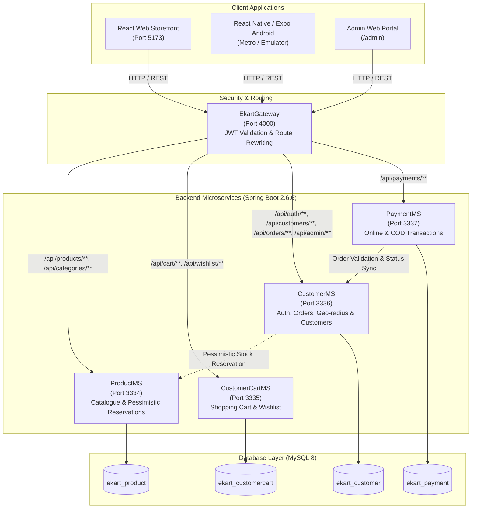
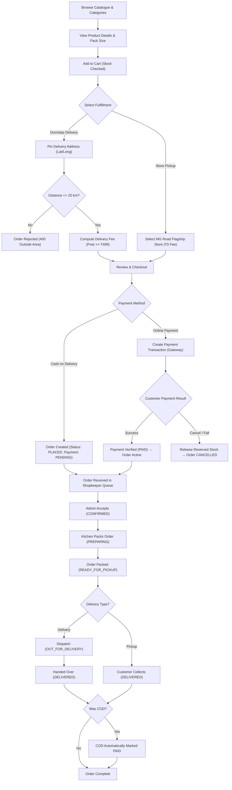
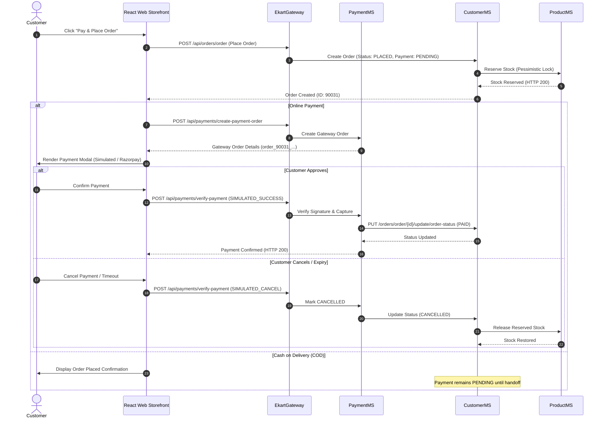
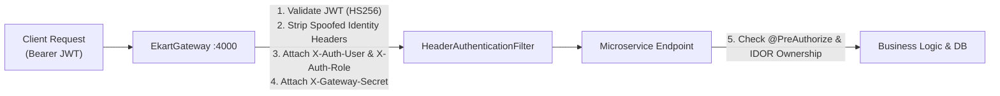

# 🍬 Mithai Junction — eKart

> **Mithai Junction** is a production-grade, full-stack Indian sweets and snacks e-commerce platform built with **React**, **TypeScript**, and **Spring Boot microservices**. It delivers a warm, consumer-grade shopping experience across Web and Android, backed by an isolated, web-based shopkeeper management portal for real-time catalogue control, pessimistic inventory reservations, order fulfillment pipelines, and customer operations.


---

## ✨ Features

### 🛍️ Customer Experience (Web & Android)

- **Authentication & Profiles**: Secure registration, login, and JWT session handling with role `CUSTOMER`.
- **Artisanal Catalogue**: 17 verified active sweets, namkeen, and festive beverages featuring verified, high-resolution product photography.
- **Rich Product Information**: Comprehensive pack details, gram/piece units, detailed ingredients, allergen disclosures, shelf-life indicators, and customer ratings.
- **Cart & Wishlist**: Real-time cart calculations, instant quantity adjustments, persistent client storage, and overselling guards.
- **Fulfillment Selection**:
  - **Doorstep Delivery**: Haversine geo-distance calculation validating customer GPS coordinates against a **20 km** store delivery radius.
  - **Store Pickup**: Free in-store pickup from the MG Road flagship store with zero delivery fees and no distance constraints.
- **Flexible Payments**:
  - **Cash on Delivery (COD)**: Payment state remains pending until handoff.
  - **Simulated Online Payment**: Complete checkout transaction flow with instant signature verification, automatic status reconciliation, and cancellation recovery.
- **Immutable Order Snapshots**: Frozen product names, pack sizes, unit prices, and delivery addresses preserved permanently against historical orders.
- **Order Tracking & Lifecycle**: Real-time status milestones, timestamped audit logs, and self-service cancellation for unfulfilled orders.

> *Note: Customer experience is available both as a responsive web app (`localhost:5173`) and as an Android native app (`ekart-android`) running on React Native / Expo.*

---

### 🧑‍💼 Shopkeeper / Admin Experience (Web Dashboard)

Accessible exclusively via `/admin` and strictly protected by backend `ROLE_ADMIN` checks:

- **Executive Dashboard**: Real-time operational metrics for today's sales revenue, active order counts, pending approvals, and low-stock alerts.
- **Live Order Fulfillment Queue**: Dedicated pipelines for delivery and pickup workflows with step-by-step state machine transitions (`CONFIRMED` → `PREPARING` → `READY_FOR_PICKUP` → `OUT_FOR_DELIVERY` / `DELIVERED`).
- **Inventory & Stock Management**: Immediate in-line stock quantity updates, automatic out-of-stock badges, and safety threshold alerts.
- **Catalogue Governance**: Product availability toggles and non-destructive product archival (preserving historical receipts).
- **Customer Directory**: Customer registry showing verified contact details and historical order frequency, with customer password hashes completely redacted.

---

## 🏗️ System Architecture

Mithai Junction is architected around decentralized Spring Boot microservices coordinated by a centralized reactive **Spring Cloud API Gateway**. Microservices communicate securely behind an isolated perimeter using a cryptographically verified gateway secret header (`X-Gateway-Secret`).



---

## 🔄 Customer Order Flow

The entire customer purchasing and store fulfillment journey is modeled as an integrated, validated flow:



---

## 📦 Order State Machine

Order state and payment state are decoupled to allow independent operational transitions and financial auditing.

### Delivery Lifecycle
$$\text{PLACED} \longrightarrow \text{CONFIRMED} \longrightarrow \text{PREPARING} \longrightarrow \text{READY\_FOR\_PICKUP} \longrightarrow \text{OUT\_FOR\_DELIVERY} \longrightarrow \text{DELIVERED}$$

### Store Pickup Lifecycle
$$\text{PLACED} \longrightarrow \text{CONFIRMED} \longrightarrow \text{PREPARING} \longrightarrow \text{READY\_FOR\_PICKUP} \longrightarrow \text{DELIVERED (Picked Up)}$$

### State Transition Rules
- **Cancellation**: Customers can cancel only while in `PLACED` status. Once accepted (`CONFIRMED`), cancellations require shopkeeper intervention with an audit note.
- **Invalid Transitions**: Skipped stages (e.g. `PLACED` directly to `DELIVERED`) are strictly rejected with `HTTP 409 Conflict`.
- **Automatic Reconciliation**: When a COD order reaches `DELIVERED`, the system automatically records `paymentStatus = PAID` with the audit note `"COD collected at handoff"`.
- **Payment Expiry**: Unpaid online orders automatically expire after **15 minutes** via a scheduled background task, releasing reserved stock.

---

## 💳 Payment Flow



---

## 📦 Inventory Concurrency & Stock Reservation

A critical engineering highlight of Mithai Junction is its **deadlock-free pessimistic concurrency control**:

1. **Cart vs. Reservation**: Adding an item to the shopping cart performs a soft availability check but **does not reserve inventory**.
2. **Pessimistic Locking (`SELECT FOR UPDATE`)**: During checkout, `ProductMS` sorts requested product IDs in natural order (`Comparator.naturalOrder()`) and locks rows sequentially via `findByIdForUpdate(productId)`. Sorting guarantees **deadlock avoidance** even under heavy concurrent checkouts.
3. **Atomic Decrement**: Available quantities are decremented and an `InventoryReservation` entity is recorded in state `RESERVED`.
4. **Idempotent Release**: If an order is cancelled or times out, `ProductMS.release(orderId)` retrieves active reservations, restores quantities atomically, and transitions the reservation to `RELEASED`. Re-invoking release has zero side effects.
5. **Overselling Guard**: If concurrent shoppers request more than the remaining stock, the second transaction is immediately rejected with `HTTP 409 Conflict` (`ProductService.INSUFFICIENT_STOCK`).

---

## 🔐 Security & Access Control



- **Perimeter Gateway Verification**: All external HTTP traffic flows through `EkartGateway`. Unauthenticated attempts to access private APIs yield `401 Unauthorized`.
- **Role Isolation**:
  - `CUSTOMER`: Permitted on cart, wishlist, profile, order creation, order tracking, and cancellation. Access to `/api/admin/**` is blocked with `403 Forbidden`.
  - `ADMIN`: Permitted on shopkeeper analytics, order fulfillment, stock modification, and customer registries.
- **Header Spoofing Prevention**: The gateway explicitly strips incoming `X-Auth-User`, `X-Auth-Role`, and `X-Gateway-Secret` from client headers before populating validated claims from the JWT.
- **Inter-Service Trust Model**: Downstream microservices enforce a `GatewaySecretFilter`. Direct internal calls bypassing the gateway secret are rejected.
- **IDOR Protection**: Order lookup (`/orders/order/{id}`) and cancellation enforce that `currentUser()` matches `order.getCustomerEmailId()`. Cross-tenant queries are blocked with `403 Forbidden`.
- **Server-Side Price Integrity**: All subtotal and discount computations query active product pricing directly from MySQL; client-submitted price attributes are completely disregarded.
- **Privacy by Design**: The admin customer registry specifically suppresses password hashes from API responses.

---

## 🛍️ Product Catalogue

The public catalogue is partitioned into three active categories:

1. **Sweet** (Category ID 1) — Traditional sweets and Bengali delicacies
2. **Namkeen** (Category ID 2) — Savoury snacks, spiced mixtures, and roasted lentils
3. **Beverages** (Category ID 3) — Artisanal festive drinks, sharbats, and whole spice blends

### Active Catalogue (17 Products)

| # | Product Name | Category | Pack / Unit | Price (₹) | Key Ingredients | Shelf Life |
|---|---|---|---|---:|---|---:|
| 1 | **Kaju Katli** | Sweet | 500 g | ₹620 | Cashew nuts, sugar, pure ghee, silver leaf (varq) | 10 days |
| 2 | **Motichoor Ladoo** | Sweet | 500 g | ₹420 | Fine gram flour pearls, pure ghee, cardamom | 7 days |
| 3 | **Besan Ladoo** | Sweet | 500 g | ₹380 | Roasted gram flour, ghee, cardamom | 12 days |
| 4 | **Gulab Jamun (12 pcs)** | Sweet | 12 pcs | ₹320 | Khoya milk solids, maida, rose-cardamom syrup | 5 days |
| 5 | **Rasgulla (12 pcs)** | Sweet | 12 pcs | ₹280 | Fresh cow milk chenna, light sugar syrup | 5 days |
| 6 | **Soan Papdi** | Sweet | 500 g | ₹260 | Gram flour, sugar, ghee, almond & pistachio flakes | 20 days |
| 7 | **Sandesh** | Sweet | 400 g | ₹340 | Artisanal fresh chenna, cardamom | 4 days |
| 8 | **Mishti Doi** | Sweet | 1 pot | ₹180 | Caramelized sweetened curd in clay handi | 3 days |
| 9 | **Chum Chum** | Sweet | 10 pcs | ₹300 | Chenna dumplings, sugar syrup, coconut flakes | 5 days |
| 10 | **Kheer Kadam** | Sweet | 8 pcs | ₹360 | Rasgulla core encased in soft mawa & milk powder | 4 days |
| 11 | **Aloo Bhujia** | Namkeen | 400 g | ₹140 | Crispy spiced potato and gram-flour sev | 60 days |
| 12 | **Navratan Mixture** | Namkeen | 400 g | ₹160 | 9-ingredient savoury mix of lentils, nuts, and sev | 45 days |
| 13 | **Khatta Meetha Mix** | Namkeen | 400 g | ₹150 | Sweet & tangy crispy mixture with peanuts | 45 days |
| 14 | **Moong Dal** | Namkeen | 400 g | ₹130 | Salted, crunchy fried split yellow lentils | 60 days |
| 15 | **Thandai (500ml)** | Beverages | 500 ml | ₹220 | Chilled milk, almonds, saffron, fennel, cardamom | 2 days |
| 16 | **Masala Chai Mix (200g)** | Beverages | 200 g | ₹180 | Whole spice blend: cinnamon, cardamom, cloves, tea | 180 days |
| 17 | **Rose Sharbat (750ml)** | Beverages | 750 ml | ₹160 | Artisanal concentrated cooling rose syrup | 365 days |

---

## 🖼️ Product Imagery & Asset Architecture

Every single product in the active catalogue is paired with verified photography stored as high-efficiency local assets:

- **Local Storage Paths**:
  - Web Storefront: `ekart-frontend/public/images/products/{slug}.jpg`
  - Backend Static Server: `project/project/ProductMS/src/main/resources/static/images/products/{slug}.jpg`
- **Component Fallbacks**: The frontend `<ProductImage />` component incorporates a multi-tier fallback mechanism:
  1. Primary `IMAGE_URL` from the product record.
  2. Local slug-matched image dictionary fallback.
  3. Clean, category-aware SVG placeholder displaying the product name without breaking page layout.

---

## 🧰 Tech Stack

| Layer | Technology | Details |
|---|---|---|
| **Web Storefront** | React 19, TypeScript, Vite 8 | Single Page Application (SPA), React Router 7, Axios, Lucide Icons |
| **Styling** | Tailwind CSS 4, Custom Design Tokens | Warm Indian sweets palette, responsive mobile-first grid |
| **Mobile App** | React Native 0.86, Expo SDK ~57 | TypeScript, Expo Location (GPS address picking), Secure Store |
| **API Gateway** | Spring Cloud Gateway 2021.0.0 | Reactive Netty, route rewriting, JWT global filter, header injection |
| **Backend Services** | Java 11, Spring Boot 2.6.6 | Spring Data JPA, Hibernate, Spring Security, REST template |
| **Database** | MySQL 8.0 | Normalized schemas (`ekart_product`, `ekart_customer`, `ekart_customercart`, `ekart_payment`) |
| **Authentication** | JSON Web Tokens (JWT) | HS256 algorithm, stateless authorization, role claims |
| **Concurrency Control** | JPA Pessimistic Locking | `SELECT ... FOR UPDATE` with sorted IDs to prevent deadlocks |
| **Payment Integration**| Hybrid Architecture | Server-side simulated payment engine (v1) + Razorpay test sandbox ready |
| **Testing & Quality** | Node.js E2E Suite, TypeScript | Full lifecycle automated E2E test suite (`scratch/test_v1_e2e.js`) |

---

## 📁 Project Structure

```text
eKart/
├── README.md                                # Project documentation
├── scratch/                                 # Automated validation suites
│   └── test_v1_e2e.js                       # Comprehensive end-to-end integration test
├── ekart-frontend/                          # React + TypeScript web storefront
│   ├── public/
│   │   └── images/products/                 # 17 verified product photos & category SVGs
│   ├── src/
│   │   ├── components/                      # Reusable UI & layout elements
│   │   ├── context/                         # CartContext, AuthContext
│   │   ├── pages/                           # Home, Catalog, Cart, Checkout, Orders, OrderDetail
│   │   │   └── admin/                       # Dashboard, Orders, Products, Customers
│   │   ├── services/api/                    # Axios API client modules
│   │   └── shared/components/               # ProductCard, ProductImage
│   ├── package.json
│   └── vite.config.ts
├── ekart-android/                           # React Native / Expo mobile application
│   ├── App.tsx                              # Mobile root component
│   ├── package.json
│   └── tsconfig.json
└── project/project/                         # Spring Boot Microservices
    ├── EkartGateway/                        # API Gateway (Port 4000)
    ├── ProductMS/                           # Products & Inventory Service (Port 3334)
    ├── CustomerCartMS/                      # Cart & Wishlist Service (Port 3335)
    ├── CustomerMS/                          # Auth, Customers & Orders Service (Port 3336)
    ├── PaymentMS/                           # Payment Processing Service (Port 3337)
    ├── EKart_MySql.sql                      # Base schema creation script
    ├── MithaiJunction_ProductSeed.sql       # 17-product catalogue seed
    └── MithaiJunction_ImageFix.sql          # Local asset image migration script
```

---

## 🚀 Local Setup

### Prerequisites

- **Java JDK 11** installed and configured on `PATH`.
- **Node.js** `v20.x` or `v22.x` and `npm`.
- **MySQL Server 8.0** running locally on port `3306` (default password: `root` or configurable via `DB_PASSWORD`).
- **Apache Maven 3.8+** (or use Maven wrapper `mvnw`).

---

### 1. Database Setup

Open a terminal and initialize the MySQL databases:

```bash
# 1. Create databases and tables
mysql -u root -p < project/project/EKart_MySql.sql

# 2. Seed the 17 active products, categories, and festive offers
mysql -u root -p ekart_product < project/project/MithaiJunction_ProductSeed.sql

# 3. Ensure verified local image assets are mapped
mysql -u root -p ekart_product < project/project/MithaiJunction_ImageFix.sql
```

---

### 2. Start the Backend Microservices

Launch the services in separate terminal tabs (or as background services). Start `ProductMS` first so Hibernate validates schema updates:

```bash
# Terminal 1: ProductMS (Port 3334)
cd project/project/ProductMS && mvn spring-boot:run

# Terminal 2: CustomerCartMS (Port 3335)
cd project/project/CustomerCartMS && mvn spring-boot:run

# Terminal 3: CustomerMS (Port 3336)
cd project/project/CustomerMS && mvn spring-boot:run

# Terminal 4: PaymentMS (Port 3337)
cd project/project/PaymentMS && mvn spring-boot:run

# Terminal 5: EkartGateway (Port 4000)
cd project/project/EkartGateway && mvn spring-boot:run
```

---

### 3. Start the Web Storefront

```bash
cd ekart-frontend
npm install
npm run dev
```

Open your browser to **`http://localhost:5173`**. Requests to `/api/**` are automatically proxied to `EkartGateway` at `http://localhost:4000`.

---

### 4. Start the Android App (Optional)

```bash
cd ekart-android
npm install
npm run android
```

> *Tip: For Android emulator testing, the app connects to the Gateway via `10.0.2.2:4000/api`. For a physical Android device over Wi-Fi, update `EXPO_PUBLIC_API_BASE_URL` to your local machine IP (e.g. `http://192.168.1.50:4000/api`).*

---

## 🌐 Service Ports

| Service | Port | Protocol | Primary Responsibility |
|---|---:|---|---|
| **React Web Client** | `5173` | HTTP | Customer storefront & Shopkeeper Admin dashboard |
| **API Gateway** | `4000` | HTTP | Gateway entry point, route dispatch, JWT authentication |
| **ProductMS** | `3334` | HTTP | Catalogue, categories, pessimistic stock reservation & release |
| **CustomerCartMS** | `3335` | HTTP | Persistent cart items, quantity updates, customer wishlist |
| **CustomerMS** | `3336` | HTTP | Customer auth, addresses, 20 km geo-radius calculation, order lifecycle |
| **PaymentMS** | `3337` | HTTP | Payment order generation, signature verification, simulated mode |
| **MySQL Database** | `3306` | TCP | Relational data persistence across 4 service databases |

---

## 🔑 Demo Credentials

| Role | Username / Email | Password | Access Level |
|---|---|---|---|
| **Shopkeeper / Admin** | `admin@mithaijunction.dev` | *Configured via local environment / seed* | Full administrative access to `/admin` dashboard |
| **Customer** | *Self-registration via UI* | *Configured during registration* | Public storefront, cart, checkout, tracking |

---

## 🧪 Verification & Testing

The project has been tested end-to-end using automated test suites, production bundlers, and static analyzers:

### 1. Automated End-to-End Suite (`test_v1_e2e.js`)
Run the integration test suite covering the complete customer-to-admin lifecycle:

```bash
node scratch/test_v1_e2e.js
```

**Test Coverage Highlights**:
- ✅ **Public Catalogue**: Exactly 17 active items verified with local photo routes and valid pricing.
- ✅ **Customer Authentication**: Registration, login, and JWT issuance with `CUSTOMER` role.
- ✅ **Cart Operations**: Add item, update quantity, read cart, and stock verification.
- ✅ **Delivery Radius**: Geo-distance check rejects addresses >20 km away (`HTTP 400`); accepts addresses <20 km away (`HTTP 201`).
- ✅ **Store Pickup**: Pickup orders bypass distance validation and incur ₹0 delivery fee.
- ✅ **Customer Order Tracking & Cancellation**: Placed orders track progression; active orders cancelled via `/orders/order/{id}/cancel` (`HTTP 204`) immediately release stock.
- ✅ **Online Payment Lifecycle**: Gateway order creation (`HTTP 201`), signature verification (`SIMULATED_SUCCESS`), status transitions to `PAID`.
- ✅ **Admin Fulfillment Pipeline**:
  - Delivery: `PLACED` → `CONFIRMED` → `PREPARING` → `READY_FOR_PICKUP` → `OUT_FOR_DELIVERY` → `DELIVERED` (auto-marks COD as `PAID`).
  - Pickup: `PLACED` → `CONFIRMED` → `PREPARING` → `READY_FOR_PICKUP` → `DELIVERED`.
- ✅ **Inventory Protection**: Concurrent overselling attempts are blocked (`HTTP 409 Conflict`).
- ✅ **Security Boundaries**: Unauthenticated admin access returns `401 Unauthorized`; customer JWT on admin API returns `403 Forbidden`; cross-customer IDOR access returns `403 Forbidden`; direct external calls to internal inventory endpoints return `403 Forbidden`.

### 2. Frontend Production Compilation
```bash
cd ekart-frontend && npm run build
```
- Compiles TypeScript cleanly via `tsc -b` and builds production bundle with Vite (`dist/` generated with zero errors).

### 3. Android Mobile Typecheck
```bash
cd ekart-android && npm run typecheck
```
- Strictly validates TypeScript typings across the React Native/Expo codebase (`tsc --noEmit` exits with code 0).

---

## 📸 Screenshots

> *UI visual documentation can be captured directly from a local running instance and saved to `docs/screenshots/`.*

### Customer Experience
| Storefront Home & Hero | Artisanal Sweets Catalogue |
|:---:|:---:|
| *(Home hero, category shortcuts, bestsellers)* | *(17 products, filter tabs, instant Add)* |

| Product Detail Modal | Shopping Cart & Delivery Mode |
|:---:|:---:|
| *(Ingredients, allergen notes, shelf life)* | *(Delivery vs Pickup toggle, 20 km check)* |

| Checkout & Simulated Payment | Order Tracking & Timeline |
|:---:|:---:|
| *(Address selection, simulated payment gateway)* | *(Live milestone progression, eligible cancellation)* |

### Admin Shopkeeper Experience
| Executive Dashboard | Live Fulfillment Queue |
|:---:|:---:|
| *(Today's revenue, order counters, stock alerts)* | *(Delivery & pickup pipelines, status action buttons)* |

| Inventory & Stock Editor | Customer Registry |
|:---:|:---:|
| *(In-line quantity adjuster, availability toggle)* | *(Order frequency, masked security credentials)* |

---

## 🎨 UI / UX Design System

Mithai Junction features a tailored visual identity crafted specifically for premium Indian confectionery:

- **Warm Food-Commerce Palette**:
  - Primary Saffron Brown: `#C68642`
  - Soft Cardamom Amber: `#E0B084`
  - Warm Sweet Cream: `#F7E7CE`
  - Deep Roasted Khoya: `#A97142`
  - Rich Dark Cocoa / Jaggery: `#3D2B1F`
- **Micro-interactions**: Responsive hover elevations, clean badge indicators for pure vegetarian items, and immediate visual feedback when modifying cart quantities.
- **Accessibility & Safety**: Explicit allergen warnings, shelf-life indicators, and clear dietary labels on every item.

---

## 📊 Business & Engineering Highlights

This codebase demonstrates key architectural patterns suitable for high-concurrency e-commerce systems:

1. **Deadlock-Free Concurrency Control**: Implements natural-order sorted pessimistic locking (`SELECT FOR UPDATE`) to prevent database-level deadlocks during flash sales.
2. **Defensive Inter-Service Architecture**: Services do not trust client headers; identity is validated once at the Gateway and propagated downstream with cryptographic proof (`X-Gateway-Secret`).
3. **Decoupled State Machines**: Decoupling the physical order pipeline from the financial payment status ensures accounting accuracy under edge cases (e.g., failed deliveries, handoff COD collections).
4. **Resilient Inventory Rollbacks**: All cancellation workflows (customer cancellation, admin cancellation, payment expiration) trigger idempotent stock release calls to prevent inventory leakage.
5. **Data Immutability**: Historical orders freeze catalog metadata (name, unit, price) into snapshot columns, preventing changes in product pricing from corrupting historical receipts.
6. **Zero Client-Side Trust**: All cart subtotals, delivery fees, and order totals are calculated exclusively on the server.

---

## ⚠️ Known Limitations (V1 Scope)

- **Simulated Payment Mode**: V1 defaults to an internal gateway simulator (`payment.gateway.mode=SIMULATED`) for friction-free local evaluation. Razorpay test sandbox keys can be configured via environment variables.
- **Single-Store Origin**: The delivery radius engine currently evaluates distances against a single flagship location (MG Road, Bengaluru). Multi-store routing is scheduled for V2.
- **Status-Based Delivery**: Order tracking uses milestone polling rather than continuous real-time GPS telemetry from driver devices.
- **Local Native Environment**: The Android mobile app requires Node.js, the Expo CLI, and an Android emulator or physical device running Expo Go.

---

## 🔮 Future Enhancements (V2 Roadmap)

- [ ] **Production Payment Gateway**: Webhook-driven payment reconciliations with Razorpay / Stripe.
- [ ] **Delivery Partner App**: Dedicated mobile interface for delivery drivers with turn-by-turn navigation.
- [ ] **Real-Time WebSockets**: Live order milestone streaming replacing polling intervals.
- [ ] **Caching Layer**: Redis cache for high-frequency catalogue reads and flash-sale product stock counters.
- [ ] **Event-Driven Messaging**: Apache Kafka / RabbitMQ integration for asynchronous order event broadcasting and email notifications.
- [ ] **Multi-Outlet Expansion**: Store selection based on closest geographic proximity.

---

## 👨‍💻 Author

**Aditya Sinha**  
- **GitHub**: [@adityasinha513](https://github.com/adityasinha513)  
- **Email**: [adityasinha513@gmail.com](mailto:adityasinha513@gmail.com)
